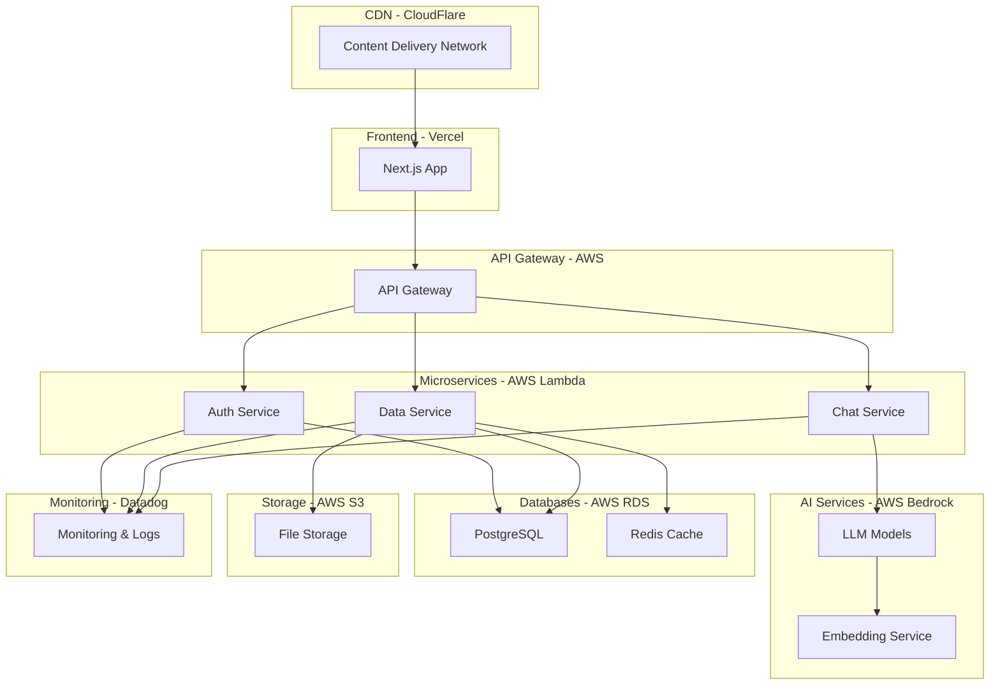

# Explicaciones Teóricas y Recomendaciones de Cloud Technology

## 1. Fundamentos Teóricos del Sistema

### 1.1. Modelos de Lenguaje (LLM) en Contexto Empresarial

Los Large Language Models (LLM) son sistemas de IA que pueden entender y generar lenguaje humano de manera coherente. En el contexto empresarial, estos modelos ofrecen:

**Ventajas:**
- **Procesamiento de Lenguaje Natural**: Entienden consultas en lenguaje natural sin necesidad de comandos específicos
- **Contextualización**: Pueden adaptar respuestas según el contexto de la compañía
- **Escalabilidad**: Atienden múltiples consultas simultáneamente
- **Aprendizaje Continuo**: Mejoran con el tiempo y el feedback

**Consideraciones:**
- **Alucinaciones**: Los LLM pueden generar información incorrecta si no se supervisan adecuadamente
- **Context Limitation**: Tienen límite en la cantidad de contexto que pueden procesar
- **Costo**: El procesamiento puede tener costos asociados según el modelo utilizado

### 1.2. Model Context Protocol (MCP)

El MCP es un estándar que permite la comunicación entre sistemas de IA y herramientas externas:

**Beneficios en nuestro sistema:**
- **Modularidad**: Permite integrar múltiples fuentes de datos (Excel, APIs, bases de datos)
- **Extensibilidad**: Fácil incorporación de nuevas capacidades
- **Seguridad**: Control sobre qué herramientas puede acceder el LLM
- **Auditoría**: Registro de las herramientas utilizadas

### 1.3. Arquitectura de Microservicios

La implementación sigue principios de microservicios:

**Características implementadas:**
- **Separación de Responsabilidades**: Frontend, API, y lógica de negocio separados
- **Comunicación por API**: Interfaz estandarizada entre componentes
- **Escalabilidad Independiente**: Cada componente puede escalarse según necesidad
- **Resiliencia**: Fallos en un componente no afectan necesariamente a otros

## 2. Tecnologías Cloud Recomendadas

### 2.1. Si tuviera acceso a todas las herramientas cloud, utilizaría:

#### **Infraestructura como Servicio (IaaS)**
- **AWS EC2** o **Google Cloud Compute Engine**: Para servidores escalables
- **AWS Lambda** o **Google Cloud Functions**: Para funciones serverless
- **Docker Containers**: Para consistencia entre ambientes

#### **Plataforma como Servicio (PaaS)**
- **Vercel**: Para Next.js (actualmente utilizado)
- **Heroku**: Como alternativa de deployment rápido
- **Google App Engine**: Para aplicaciones escalables

#### **Base de Datos como Servicio (DBaaS)**
- **PostgreSQL on Amazon RDS**: Para datos estructurados de empleados
- **MongoDB Atlas**: Para datos flexibles y documentos
- **Redis Cloud**: Para caching y sesiones
- **Amazon S3**: Para almacenamiento de archivos (reemplazar archivo Excel)

#### **Servicios de IA/ML**
- **OpenAI GPT-4/GPT-3.5**: Para LLM más potentes
- **Google Vertex AI**: Para modelos de lenguaje de Google
- **Amazon Bedrock**: Para acceso a múltiples modelos de LLM
- **Hugging Face**: Para modelos especializados en español

#### **Servicios de Monitoreo y Observabilidad**
- **Datadog**: Para monitoreo completo de la aplicación
- **Sentry**: Para tracking de errores
- **Google Analytics**: Para análisis de uso
- **LogRocket**: Para reproducción de sesiones de usuario

### 2.2. Arquitectura Cloud Ideal

## 3. Justificación de Selecciones

### 3.1. ¿Por qué estos servicios específicos?

#### **Vercel para Frontend**
- **Optimización Automática**: Built-in optimizations para Next.js
- **CI/CD Integrado**: Despliegue automático con git
- **Global CDN**: Distribución mundial del contenido
- **Edge Functions**: Computación en el borde para mejor rendimiento

#### **AWS Lambda para Backend**
- **Pay-per-use**: Solo pagas por lo que usas
- **Escalabilidad Automática**: No hay que administrar servidores
- **Integración Nativa**: Con otros servicios AWS
- **Cold Start Optimization**: Rápida inicialización

#### **PostgreSQL para Datos**
- **ACID Compliance**: Integridad de datos garantizada
- **JSON Support**: Flexibilidad para datos no estructurados
- **Performance**: Excelente rendimiento para consultas complejas
- **Ecosistema**: Amplio soporte y herramientas

#### **AWS Bedrock para LLM**
- **Múltiples Modelos**: Acceso a Claude, Llama, Titan, etc.
- **Privacidad**: Datos no utilizados para entrenamiento
- **Consistencia**: API unificada para diferentes modelos
- **Cost Control**: Límites y monitoreo de uso

### 3.2. Comparación con Alternativas

#### **Base de Datos: PostgreSQL vs MongoDB**
- **PostgreSQL**: Mejor para datos estructurados y relaciones complejas
- **MongoDB**: Más flexible pero menos consistente para datos financieros
- **Decisión**: PostgreSQL por la naturaleza crítica de los datos de RRHH

#### **LLM: OpenAI vs AWS Bedrock vs Google Vertex AI**
- **OpenAI**: Modelo más avanzado pero dependencia de un solo proveedor
- **AWS Bedrock**: Variedad de modelos, mejor integración con AWS
- **Google Vertex AI**: Fuerte en modelos multilingües
- **Decisión**: AWS Bedrock por flexibilidad y ecosistema

#### **Frontend: Vercel vs AWS Amplify vs Netlify**
- **Vercel**: Optimizado específicamente para Next.js
- **AWS Amplify**: Más completo pero más complejo
- **Netlify**: Bueno pero menos optimizado para Next.js
- **Decisión**: Vercel por especialización en Next.js

## 4. Estrategia de Implementación por Fases

### 4.1. Fase 1: MVP (Actual)
- **Frontend**: Vercel con Next.js
- **Backend**: API Routes de Next.js
- **Datos**: Archivo Excel local
- **LLM**: z-ai-web-dev-sdk local
- **Autenticación**: Ninguna (demo)

### 4.2. Fase 2: Producción Básica
- **Frontend**: Vercel (mismo)
- **Backend**: Migrar a AWS Lambda
- **Datos**: PostgreSQL en AWS RDS
- **LLM**: AWS Bedrock con Claude
- **Autenticación**: NextAuth.js
- **Monitoreo**: Sentry básico

### 4.3. Fase 3: Escala Empresarial
- **Frontend**: Vercel Enterprise
- **Backend**: Microservices en AWS Lambda
- **Datos**: PostgreSQL + Redis cache
- **LLM**: Múltiples modelos en AWS Bedrock
- **Autenticación**: SSO con proveedores empresariales
- **Monitoreo**: Stack completo (Datadog, Sentry, etc.)
- **CI/CD**: GitHub Actions con testing automatizado

## 5. Consideraciones de Seguridad y Cumplimiento

### 5.1. Seguridad de Datos
- **Encriptación**: TLS 1.3 en tránsito, AES-256 en reposo
- **Acceso**: Principio de menor privilegio
- **Auditoría**: Logs de todos los accesos a datos
- **Backup**: Automático y geográficamente distribuido

### 5.2. Cumplimiento Normativo
- **LGPD**: Ley de Protección de Datos de Brasil
- **GDPR**: Regulación Europea (si aplica)
- **Ley 1581 de 2012**: Protección de datos en Colombia
- **ISO 27001**: Estándar internacional de seguridad

### 5.3. Mejores Prácticas
- **Secret Management**: AWS Secrets Manager o HashiCorp Vault
- **Network Security**: VPC, Security Groups, WAF
- **Code Security**: SAST/DAST en pipeline de CI/CD
- **Penetration Testing**: Pruebas de seguridad regulares

## 6. Análisis de Costos (Estimaciones Mensuales)

### 6.1. Configuración Pequeña (100-500 usuarios)
- **Vercel Pro**: $20/mes
- **AWS Lambda**: ~$10/mes
- **PostgreSQL RDS**: ~$25/mes
- **AWS Bedrock**: ~$50-100/mes (depende del uso)
- **Monitoring**: ~$20/mes
- **Total**: ~$125-175/mes

### 6.2. Configuración Mediana (500-2000 usuarios)
- **Vercel Pro**: $20/mes
- **AWS Lambda**: ~$50/mes
- **PostgreSQL RDS**: ~$100/mes
- **AWS Bedrock**: ~$200-500/mes
- **Redis Cache**: ~$30/mes
- **Monitoring**: ~$50/mes
- **Total**: ~$450-750/mes

### 6.3. Configuración Empresarial (2000+ usuarios)
- **Vercel Enterprise**: $200+/mes
- **AWS Lambda**: ~$200/mes
- **PostgreSQL RDS**: ~$500/mes
- **AWS Bedrock**: ~$1000+/mes
- **Redis Cache**: ~$100/mes
- **Monitoring**: ~$200/mes
- **Additional Services**: ~$300/mes
- **Total**: ~$2500+/mes

## 7. Conclusiones y Recomendaciones Finales

### 7.1. Resumen de Arquitectura Recomendada
La arquitectura ideal combina:
- **Frontend moderno** con Next.js en Vercel
- **Backend serverless** con AWS Lambda
- **Base de datos robusta** con PostgreSQL
- **LLM flexible** con AWS Bedrock
- **Monitoreo completo** con herramientas especializadas

### 7.2. Ventajas Competitivas
- **Rendimiento**: CDN global y edge computing
- **Escalabilidad**: Infraestructura elástica
- **Costo-Efectividad**: Modelo pay-per-use
- **Seguridad**: Cumplimiento normativo y mejores prácticas
- **Innovación**: Acceso a últimas tecnologías de IA

### 7.3. Próximos Pasos
1. **Migración gradual** del MVP a producción
2. **Implementación de autenticación** y autorización
3. **Integración con sistemas HR** existentes
4. **Expansión de capacidades** del LLM
5. **Optimización de costos** basada en uso real

Esta arquitectura proporciona una base sólida y escalable para el agente de chat de RRHH, permitiendo crecimiento futuro sin sacrificar rendimiento o seguridad.